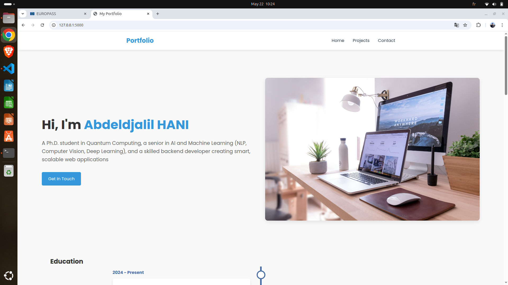
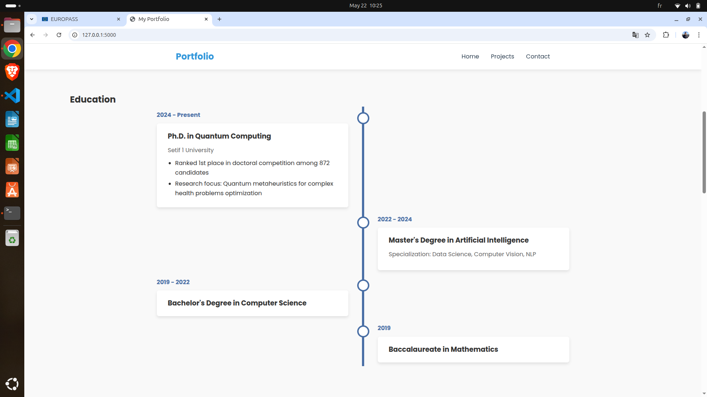
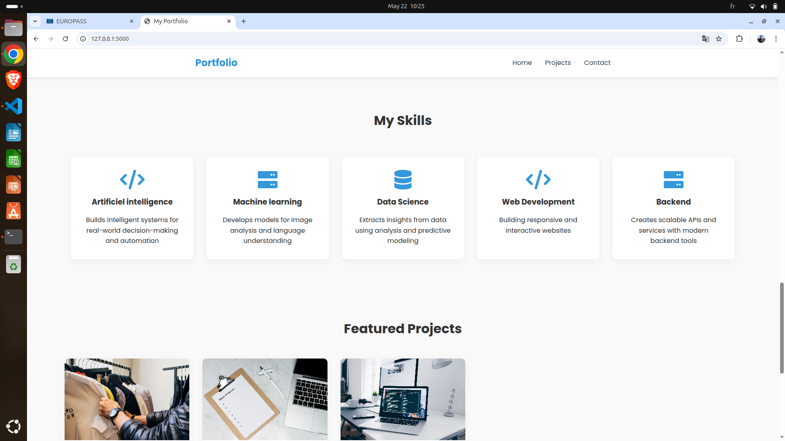
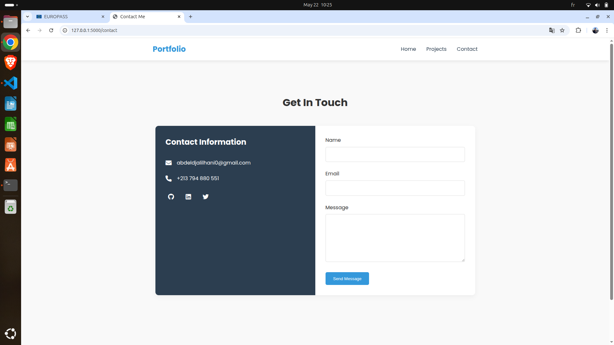

# 🧠 My Personal Portfolio Website

Welcome to my personal portfolio! This website showcases my academic background, professional experience, and projects in artificial intelligence, backend development, and research. It is designed to reflect my journey as a **Ph.D. researcher**, **machine learning engineer**, and **educator**.

---

## 📸 Preview

Here are a few screenshots from the website:

   
   
   
  

---

## 📂 Sections Included

### 🏠 Home
- Clean landing page with a professional look
- Hero section introducing who I am
- Easy navigation to all major parts of the site

### 🎓 Education & 💼 Experience
- Academic milestones (PhD, Master's, Bachelor's)
- Teaching, research, and professional roles
- Timeline-style layout for clarity

### 🛠️ Projects
- A collection of my work in AI, computer vision, backend development, and more
- Each project includes an image, description, and external link (GitHub/demo)

---

## 🛠️ Technologies Used

- **Frontend:** HTML5, CSS3, Bootstrap, JavaScript
- **Backend:** Flask (Python)
- **Deployment:** GitHub Pages

---

## 📧 Contact

Feel free to reach out:

- 📫 Email: abdeldjalilhani0@gmail.com
- 🌐 LinkedIn: [Your LinkedIn](www.linkedin.com/in/abdeldjalil-hani-b50172205)  
- 🐙 GitHub: [@yourusername](https://github.com/AbdeldjalilHANI)

---

## 📌 License
This project is licensed under the [MIT License](LICENSE).

---

## 🙏 Acknowledgements

Thanks for visiting! If you find something useful or inspiring here, feel free to star ⭐ the repo or connect with me.
